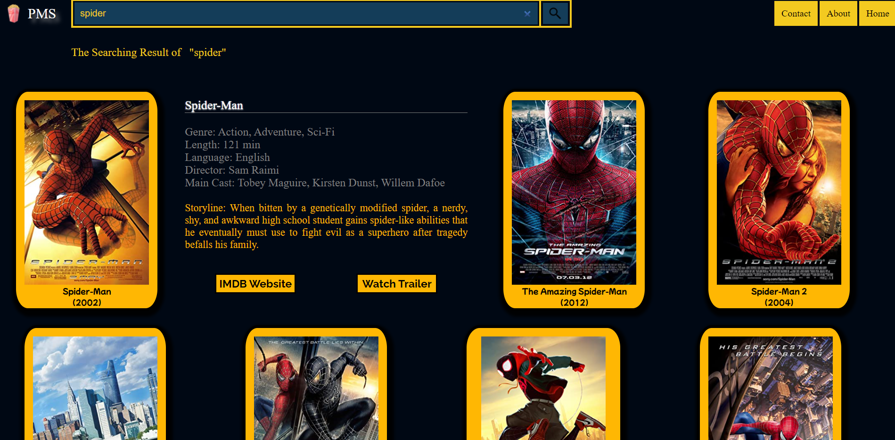

# PopcornMovieSearch
IMDb API Search Web (for PC only)
 URL Site: https://yenloned.github.io/PopcornMovieSearch/
 
  PopcornMovieSearch is a website that provides an API Search function for movie searching. This website was developed in a full stack team of 2 people.
## Technologies
HTML5, CSS, JavaScript, node.js
 
## Website Preview

## Contributors
 Credit to development team member:
 [Raymond Chau](https://github.com/Raymondchau1022)

## Epilogue
This is my very first web project. It may be flawed but it is a great learning experience. Enjoy!

